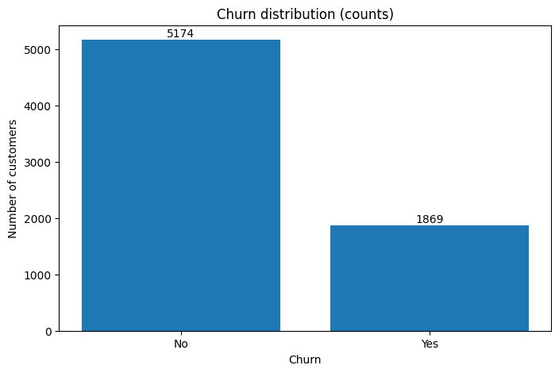

# Customer Churn Prediction — End-to-End ML Pipeline

## Overview

This repository contains all artifacts, scripts, processed data, saved preprocessors, the trained XGBoost model, notebooks, and a demo Streamlit app for an end-to-end churn prediction project. The goal of this project was to predict whether a customer will churn (leave) based on account, service and demographic attributes.

The pipeline includes:

- Exploratory Data Analysis (EDA) to understand and clean the raw dataset

- Feature engineering and a reproducible preprocessing pipeline (ColumnTransformer + Pipeline)

- Model training and hyperparameter tuning using XGBoost on AWS SageMaker (HPO)

- Local evaluation with precision, recall, F1-score, ROC-AUC and confusion matrices

- A lightweight Streamlit app for local inference using the same preprocessor and saved model

## Repo Layout

| Folder / File (path)                                       | Purpose / notes                                                                                     |
| ---------------------------------------------------------- | --------------------------------------------------------------------------------------------------- |
| `jupyter notebooks/fe.ipynb`                               | Local feature-engineering notebook (EDA, preprocessing, baseline models).                           |
| `jupyter notebooks/sagemaker_hpo.ipynb`                    | SageMaker HPO / training notebook (launches XGBoost tuning and inspects jobs).                      |
| `preprocessors/preprocessor_output_columns.json`           | Final output column names after preprocessing (for debugging).                                      |
| `preprocessors/preprocessor_raw_columns.json`              | Raw input column order expected by the preprocessor (used by app).                                  |
| `preprocessors/preprocessor.joblib`                        | Saved sklearn `ColumnTransformer` / pipeline (load at inference).                                   |
| `processed data/churn_processed.csv`                       | Final processed dataset (features + label) used for experiments.                                    |
| `processed data/test.csv`                                  | Local test CSV (you also used in local evaluation).                                                 |
| `processed data/train_for_sagemaker.csv`                   | Train CSV formatted for SageMaker (label-first or otherwise as prepared).                           |
| `processed data/train.csv`                                 | Another training CSV (kept for record / alternative formatting).                                    |
| `processed data/validation_for_sagemaker.csv`              | Validation CSV formatted for SageMaker (label-first).                                               |
| `processed data/validation.csv`                            | Another validation CSV (kept for local eval / record).                                              |
| `raw data/raw.csv`                                         | Original raw dataset uploaded (source CSV).                                                         |
| `app.py` (root)                                            | Streamlit demo app (loads `preprocessor.joblib`, `preprocessor_raw_columns.json`, `xgboost-model`). |
| `Customer Churn Prediction - Project Report.pdf`  (root) | Project report                      |
| `graphs`                               | All the relevant grpahs                 |
| `README.md` (root)                                         | This README / project overview.                                                                     |

## Project Workflow

### 1. Data Exploration (EDA)

- Loaded raw_data/raw.csv into Pandas and inspected types, missing values and distributions.

- Found that TotalCharges was read as object and converted it to numeric; 11 rows became NaN (all had tenure == 0) — treated as new-customer cases and handled explicitly.

- Observed class imbalance: Churn ≈ 26.5% Yes, 73.5% No.

    

    

    

    

### 2. Feature engineering & preprocessing

- Grouped columns and applied transformations:

    - tenure, MonthlyCharges → StandardScaler (z-score)

    - TotalCharges → RobustScaler (median & IQR scaling)

    - SeniorCitizen → passthrough (binary 0/1)

    - Categorical columns (gender, Partner, Dependents, PhoneService, MultipleLines, InternetService, OnlineSecurity, OnlineBackup, DeviceProtection, TechSupport, StreamingTV, StreamingMovies, Contract, PaperlessBilling, PaymentMethod) → OneHotEncoder(drop='first', handle_unknown='ignore')

- Implemented the transforms inside a ColumnTransformer wrapped in an sklearn.Pipeline.

### 3. Data Preparation for SageMaker

- Prepared SageMaker CSVs with the label as the first column and no header (XGBoost built-in requires label first):

    - processed_data/train_for_sagemaker.csv (70%)

    - processed_data/validation_for_sagemaker.csv (15%)

    - processed_data/test_for_sagemaker.csv (15%)

### 4. Baseline local modeling & evaluation

- Trained baseline models locally using the processed features (X_processed_df):

    - Logistic Regression (baseline)

    - Random Forest (baseline)

Evaluated with precision, recall, F1-score and ROC-AUC using an 80/20 stratified split.

#### Key baseline metrics (local test set, n ≈ 1,409):

1. Logistic (baseline) — ROC-AUC: 0.8422  
- Churn precision: 0.66  recall: 0.56  f1: 0.60

2. Random Forest (baseline) — ROC-AUC: 0.8258  
- Churn precision: 0.63  recall: 0.49  f1: 0.55

### 5. Handling class imbalance & threshold tuning

- Trained Logistic Regression with class_weight='balanced' to raise churn recall.

- Computed precision/recall across thresholds and selected candidate thresholds for business trade-offs.

#### Example threshold trade-offs (class-weighted logistic):

    Threshold 0.5 → recall ≈ 0.78, precision ≈ 0.51  
    Threshold 0.4 → recall ≈ 0.87, precision ≈ 0.47  
    Threshold 0.3 → recall ≈ 0.93, precision ≈ 0.43

   

### 6. SageMaker XGBoost hyperparameter tuning (HPO)

- Configured a SageMaker XGBoost Estimator and HyperparameterTuner:

    - Fixed: objective=binary:logistic, eval_metric=auc, num_round=200

    - Search space (Bayesian): eta (0.01–0.3), max_depth (3–10), min_child_weight (1–10), subsample (0.5–1.0), colsample_bytree (0.5–1.0)

    - Tuner config: objective_metric_name="validation:auc", max_jobs=12, max_parallel_jobs=2, strategy="Bayesian"

### 7. Model evaluation — best XGBoost (final)

- Loaded the best XGBoost model locally and evaluated on processed_data/test.csv (label-first, n = 1,057).

#### Final XGBoost test metrics:

    Test ROC-AUC: 0.8553  
    Precision (churn): 0.51  
    Recall (churn): 0.82  
    F1 (churn): 0.63  
    Accuracy: 0.75

#### Confusion matrix (XGBoost on test):

|                | Predicted No (Negative) | Predicted Yes (Positive) |
| -------------: | ----------------------: | -----------------------: |
|  **Actual No** |     True Negative = 561 |     False Positive = 216 |
| **Actual Yes** |     False Negative = 51 |      True Positive = 229 |

### 8. Monitoring & logs

- SageMaker training logs were observed via the notebook and CloudWatch for debugging HPO failures and progress.

- Important checks: training job status, CloudWatch logs for stack traces, and metrics for validation:auc.

### Conclusion

#### Built and validated a full churn prediction pipeline:

- Data cleaning and careful handling of TotalCharges NaNs (new customers).

- Reproducible preprocessing with preprocessor.joblib and saved input/output column lists.

- Baseline models and a tuned XGBoost model (SageMaker HPO) that achieved the best ROC-AUC (≈ 0.8553) and high churn recall (≈ 0.82) at the evaluated threshold.

- A Streamlit app (app.py) that performs inference with the saved preprocessor and local xgboost-model file for demo and low-throughput usage.
   
    